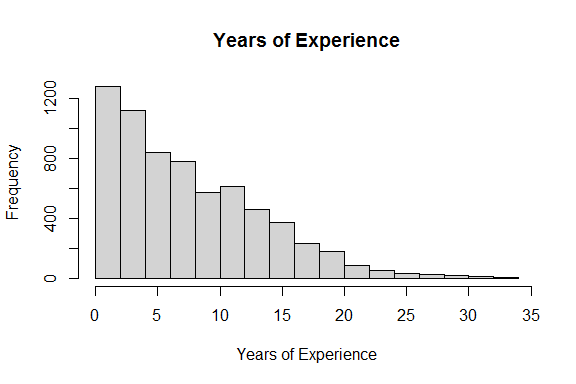
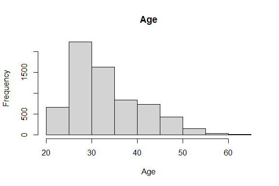
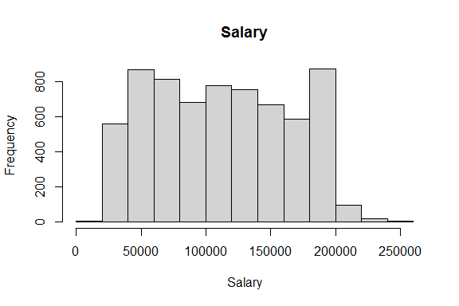
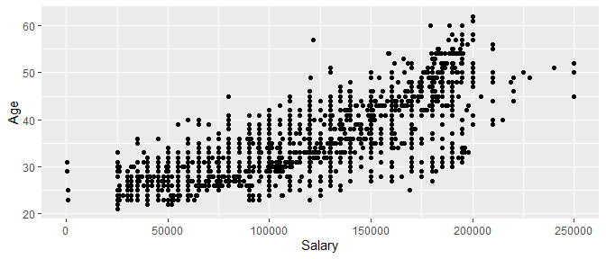
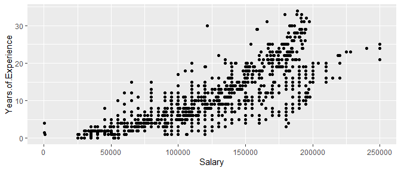
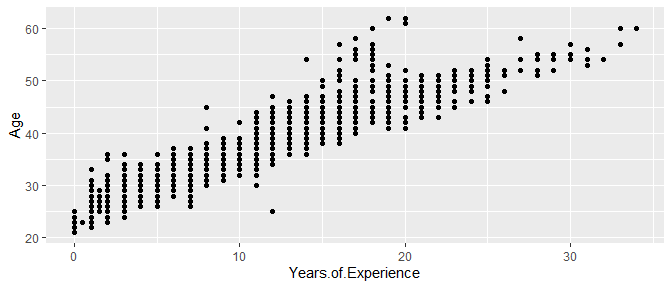
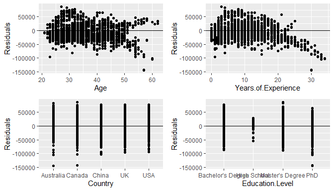
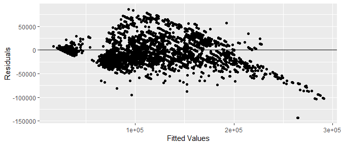
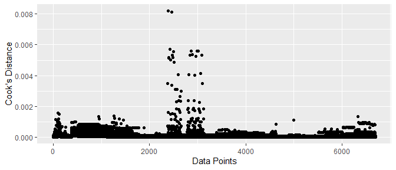

Multiple Linear Regression Exploratory Demo
================
David Bird
7/25/2023

## Introduction

In this demo, I’m going to use Multiple Linear Regression to conduct
descriptive data analysis on a dataset. Descriptive analysis describes
the data as it is, whereas inference attempts to use the data to
describe the population it came from, and prediction attempts to predict
a given future data value or values.

We are going to look at the relationship between salary as a response
variable, and Age, Years of Experience, Country, and Education Level as
explanatory variables. I’m using a Kaggle dataset which provides salary
data along with Age, Gender, Education Level, Job Title, Years of
Experience, Country, and Race (with X being an index variable for the
rows). Let’s take a look!

Data source:
**<https://www.kaggle.com/datasets/sudheerp2147234/salary-dataset-based-on-country-and-race>**

Since we’re not conducting statistical inference, we can snoop and look
at the data we’re dealing with. I usually look at the first few rows,
the structure, and a summary of the variables showing mins and maxes.

## Explore the Data

**The first six rows of the dataset:**

    ##   X Age Gender Education.Level         Job.Title Years.of.Experience Salary
    ## 1 0  32   Male      Bachelor's Software Engineer                   5  90000
    ## 2 1  28 Female        Master's      Data Analyst                   3  65000
    ## 3 2  45   Male             PhD    Senior Manager                  15 150000
    ## 4 3  36 Female      Bachelor's   Sales Associate                   7  60000
    ## 5 4  52   Male        Master's          Director                  20 200000
    ## 6 5  29   Male      Bachelor's Marketing Analyst                   2  55000
    ##   Country     Race
    ## 1      UK    White
    ## 2     USA Hispanic
    ## 3  Canada    White
    ## 4     USA Hispanic
    ## 5     USA    Asian
    ## 6     USA Hispanic

**The dataset structure:**

    ## 'data.frame':    6704 obs. of  9 variables:
    ##  $ X                  : int  0 1 2 3 4 5 6 7 8 9 ...
    ##  $ Age                : num  32 28 45 36 52 29 42 31 26 38 ...
    ##  $ Gender             : chr  "Male" "Female" "Male" "Female" ...
    ##  $ Education.Level    : chr  "Bachelor's" "Master's" "PhD" "Bachelor's" ...
    ##  $ Job.Title          : chr  "Software Engineer" "Data Analyst" "Senior Manager" "Sales Associate" ...
    ##  $ Years.of.Experience: num  5 3 15 7 20 2 12 4 1 10 ...
    ##  $ Salary             : num  90000 65000 150000 60000 200000 55000 120000 80000 45000 110000 ...
    ##  $ Country            : chr  "UK" "USA" "Canada" "USA" ...
    ##  $ Race               : chr  "White" "Hispanic" "White" "Hispanic" ...

**A numerical summary of the dataset:**

    ##        X             Age           Gender          Education.Level   
    ##  Min.   :   0   Min.   :21.00   Length:6704        Length:6704       
    ##  1st Qu.:1676   1st Qu.:28.00   Class :character   Class :character  
    ##  Median :3352   Median :32.00   Mode  :character   Mode  :character  
    ##  Mean   :3352   Mean   :33.62                                        
    ##  3rd Qu.:5027   3rd Qu.:38.00                                        
    ##  Max.   :6703   Max.   :62.00                                        
    ##                 NA's   :2                                            
    ##   Job.Title         Years.of.Experience     Salary         Country         
    ##  Length:6704        Min.   : 0.000      Min.   :   350   Length:6704       
    ##  Class :character   1st Qu.: 3.000      1st Qu.: 70000   Class :character  
    ##  Mode  :character   Median : 7.000      Median :115000   Mode  :character  
    ##                     Mean   : 8.095      Mean   :115327                     
    ##                     3rd Qu.:12.000      3rd Qu.:160000                     
    ##                     Max.   :34.000      Max.   :250000                     
    ##                     NA's   :3           NA's   :5                          
    ##      Race          
    ##  Length:6704       
    ##  Class :character  
    ##  Mode  :character  
    ##                    
    ##                    
    ##                    
    ## 

**I check for outliers first. Years.of.Experience looks like it might
have some outliers, with a mean of 8, 3rd quartile of 12, and Max of 34,
so I’ll look at the histograms to see.**

<!-- --><!-- --><!-- -->
Years.of.Experience definitely has a long right tail, but I wouldn’t
exactly call 34 an outlier here, because it’s more like a natural
progression of the data. The other histograms look fine. Keep in mind
that we don’t automatically remove outliers anyway, because sometimes
those are the most interesting points for study!

## Cleaning the Data

Next, I look for missing values. The options with missing values are:
replace the missing values with something, such as the mean of the
column the missing value is in, or delete the row that contains the
missing data;in most cases, R will do this for you, so you don’t have to
(Python will not, to my knowledge). Obviously you don’t want to delete
large swaths of data from your dataset if you can help it.

    ## [1] "Bachelor's"        "Master's"          "PhD"              
    ## [4] ""                  "Bachelor's Degree" "Master's Degree"  
    ## [7] "High School"       "phD"

I see that while the summary reports find no missing values within the
text variables, if we list, say, the Education Levels, we see that some
just have ““, which is really a missing value. Also, we see PhD and phD
listed separately, as well as Bachelor’s and Bachelor’s Degree (and
again with Master’s), when these are really the same thing. I need to
clean it up!

    ## [1] "Bachelor's Degree" "Master's Degree"   "PhD"              
    ## [4] NA                  "High School"

**Number of NA values in Education.Level:**

    ## [1] 3

We now see that there is 1 entry for PhD, 1 for Master’s, etc, and that
there are 3 missing (NA) values here. I’ll perform a similar cleanup on
the other variables, but I omit the visualization for brevity. I will
list the number of NA values in each column.

    ##                   X                 Age              Gender     Education.Level 
    ##                   0                   2                   2                   3 
    ##           Job.Title Years.of.Experience              Salary             Country 
    ##                   2                   3                   5                   0 
    ##                Race 
    ##                   0

The highest number of NA values is 5, in the Salary column. Out of 6700
data points, this is not significant. In determining whether or not to
delete a large number of NA values, we have to consider whether the data
is missing at random (such as dropped packets during data transmission)
or missing not at random (such as if someone went in and deleted the
highest 5 salaries). Since we have so few missing values, let’s take a
look at those rows:

    ##         X Age Gender   Education.Level           Job.Title Years.of.Experience
    ## 173   172  NA   <NA>              <NA>                <NA>                  NA
    ## 261   260  NA   <NA>              <NA>                <NA>                  NA
    ## 2012 2011  27   Male              <NA>           Developer                   7
    ## 3137 3136  31   Male   Master's Degree Full Stack Engineer                   8
    ## 5248 5247  26 Female Bachelor's Degree            Social M                  NA
    ## 6456 6455  36   Male Bachelor's Degree      Sales Director                   6
    ##      Salary Country  Race
    ## 173      NA      UK White
    ## 261      NA  Canada White
    ## 2012  1e+05      UK White
    ## 3137     NA  Canada White
    ## 5248     NA     USA White
    ## 6456     NA  Canada White

We will be asking exploratory questions related to the salary, so I’m
going to drop the rows with a missing salary. We will proceed with
exploratory analysis from here, with the assumption that our 5 salaries
were missing at random.

    ##                   X                 Age              Gender     Education.Level 
    ##                   0                   0                   0                   1 
    ##           Job.Title Years.of.Experience              Salary             Country 
    ##                   0                   0                   0                   0 
    ##                Race 
    ##                   0

## Feature Scaling and Encoding Categorical Variables

The next things to consider are feature scaling, or standardization, and
encoding categorical variables. We don’t have to standardize the data
for Multiple Linear Regression, and we don’t have to encode categorical
variables in R–R will do it automatically. I’ve commented out the code
for encoding the categorical variables as factors in case you want to
run it, but I’ll leave it out to demonstrate that R handles it for us.

## Assumptions of Multiple Linear Regression and Independence

Now that I’ve finished cleaning the data, it’s time to check the data
for its adherence to the assumptions of Multiple Linear Regression, and
for multicollinearity. The assumptions are: 1. The data must be
independent 2. The response variable must have a linear relationship
with the explanatory variables 3. The residuals must be normally
distributed around the mean 4. The residuals must have constant variance
around the mean

This is a Kaggle dataset, and doesn’t have a lot of information on the
data collection methods. For this demo, I will assume that the data is
independent.

To examine linearity, I will plot Salary against the other numerical
variables. We’ll also look at Age vs Years of Experience to check for
multicollinearity:

<!-- --><!-- --><!-- -->
We see that there is definitely evidence of a linear relationship
between Salary and the other variables, and we see some evidence of
multicollinearity between Age and Years of Experience. This can affect
the variance of the estimates of the effect of Age vs the effect of
Years of Experience.

I will now fit a multiple linear regression model, using Salary as the
response variable, and Age, Years of Experience, Country, and Education
Level as explanatory variables. The mathematical model is as follows,
with education level Bachelor’s and Country Australia being factored in
as the default:

## Mathematical Model and Model Summary

*ŷ* = *β*0 + *β*1*A**g**e* + *β*2*Y**e**a**r**s*.*o**f*.*E**x**p**e**r**i**e**n**c**e* + *β*3*C**o**u**n**t**r**y**C**a**n**a**d**a* + *β*4*C**o**u**n**t**r**y**C**h**i**n**a* + *β*5*C**o**u**n**t**r**y**U**K*+
 + *β*6*C**o**u**n**t**r**y**U**S* + *β*7*H**i**g**h**S**c**h**o**o**l* + *β*8*M**a**s**t**e**r**s* + *β*9*P**h**D* + *ϵ**i*

Model Summary:

    ## 
    ## Call:
    ## lm(formula = Salary ~ Age + Years.of.Experience + Country + Education.Level, 
    ##     data = dat)
    ## 
    ## Residuals:
    ##     Min      1Q  Median      3Q     Max 
    ## -143656  -19241   -4064   17051   86686 
    ## 
    ## Coefficients:
    ##                                Estimate Std. Error t value Pr(>|t|)    
    ## (Intercept)                    110760.4     3318.3  33.378   <2e-16 ***
    ## Age                             -1918.8      132.1 -14.522   <2e-16 ***
    ## Years.of.Experience              8009.7      167.6  47.795   <2e-16 ***
    ## CountryCanada                    -271.8     1095.3  -0.248    0.804    
    ## CountryChina                    -1242.0     1091.8  -1.138    0.255    
    ## CountryUK                       -1836.7     1093.3  -1.680    0.093 .  
    ## CountryUSA                      -1733.5     1088.6  -1.593    0.111    
    ## Education.LevelHigh School     -36898.7     1454.3 -25.372   <2e-16 ***
    ## Education.LevelMaster's Degree  10602.2      885.7  11.971   <2e-16 ***
    ## Education.LevelPhD              23423.3     1112.9  21.047   <2e-16 ***
    ## ---
    ## Signif. codes:  0 '***' 0.001 '**' 0.01 '*' 0.05 '.' 0.1 ' ' 1
    ## 
    ## Residual standard error: 28240 on 6688 degrees of freedom
    ##   (1 observation deleted due to missingness)
    ## Multiple R-squared:  0.7142, Adjusted R-squared:  0.7138 
    ## F-statistic:  1857 on 9 and 6688 DF,  p-value: < 2.2e-16

We see that Age and Years of Experience both have significant effects on
Salary, that Country isn’t deemed significant by the model, and that
High School, Master’s, and PhD have a strong effect on Salary compared
to Bachelor’s. I will check residual diagnostics for the other model
assumptions. Note that in the summary, 1 observation was deleted due to
missingness, illustrating that R will deal with missing values for you.

Multiple R-squared is 0.7142; that is, the model accounts for about 71%
of the variance we see in the data, which is a good indication that the
model is a good fit.

## Residual plots: linearity, normality, and constant variance checks

Using the augment function from the broom package enables us to easily
plot the residuals vs each explanatory variable.

<!-- -->

We don’t find any evidence of non-normality, and no major signs of
non-constant variance in the residuals vs the explanatory variables,
apart from some negative residuals on the high end, which could be
significant, or could simply be where a portion of the data landed, but
not enough to pull the regression line. Next I plot the residuals vs the
fitted values; that is, the distance between the individual values and
the estimated line.

<!-- -->
Taking a look at the residuals vs the fitted values, we don’t see much
evidence of non-normality or non-constant variance, but there’s a slight
pattern that can indicate some non-linearity. However, the Multiple
R-squared value indicated a good fit, so it’s not *too* alarming in this
case. For inference to the population, the four assumptions of Multiple
Linear Regression are essential for valid inference, and for prediction,
they’re still important, although the prediction error will speak for
itself. For description, we still need the MLR model to be a good fit,
so it’s important that the assumptions are satisfied, and that we have a
decent Multiple R-squared value to indicate that our analysis is valid.

## Cook’s Distance for Outliers

One more check we can perform for outliers is to examine the Cook’s
distance, in order to assess whether any values in particular had a high
influence on the model statistics. If a data point’s removal would
result in a large change to the model’s beta estimates, then that data
point will have a high Cook’s distance.

<!-- -->
The highest points had a Cook’s distance of about 0.008–very small. This
provides an empirical backing to our visual estimate that there are no
concerning outliers in the data.

## Variance Inflation Factor for Multicollinearity

For a more formal check for multicollinearity other than the plot
examination above, we can check the Variance Inflation Factor.

    ##                         GVIF Df GVIF^(1/(2*Df))
    ## Age                 8.500703  1        2.915597
    ## Years.of.Experience 8.660096  1        2.942804
    ## Country             1.002686  4        1.000335
    ## Education.Level     1.615383  3        1.083210

We see that Age and Years of Experience have particularly high VIF
values (not close to 1), indicating the multicollinearity we suspected
before. Multicollinearity causes the variance of these two variables to
increase, as it is difficult to assess which was responsible for the
effects measured, since the two variables coincide so much. One approach
would be to fit multiple models, each containing only one of the two
variables. For this demo, though, I just wanted to touch on it.

## Summary

**The four assumptions of multiple linear regression were checked.
Independence was assumed due to the difficulty of examination of data
collection (and the fact that this is a demo). Linearity of the
numerical variables against the response was shown in residual plots,
and backed up by the Multiple R-squared value of 0.71. Normality and
constant variance of the residuals were assessed graphically as well.
Multicollinearity of Age and Years of Experience was suspected
graphically and confirmed with the Variance Inflation Factor (note that
we would then NOT construct confidence intervals based on the variance
in the model summary). We empirically checked for outliers with Cook’s
Distance and found none.**

**With these checks satisfied, the Multiple Linear Regression model is
valid with the following findings. Note that these are observed
correlations only; we are not conducting inference to the population–to
conduct inference on a population, we would have to randomly select
employees from the population, and we have no guarantee that that’s
where these data came from. Nor can we make causal inference, because we
did not conduct randomized trials.**

**With an intercept of $110,760, we find that Age is significant with
p-value \< 0.01. On average, each year of age decreases salary by
$1,919, holding all other variables constant. Years of Experience is a
significant variable also, with p-value \< 0.01. Holding all other
variables constant, each year of experience increases salary by $8,010.
High School, Master’s, and PhD are all significant, each with p-value \<
0.01. Having only a High School education, compared to the intercept
value of a Bachelor’s, decreases salary by $36,899 on average, holding
all other variables constant. A Master’s degree increases salary by
$10,602, on average, and a PhD increases salary by an average of
$23,423, holding all other variables constant.**

**A more prescriptive statement about the data than the formal
statistical analysis would be welcome by stakeholders. What I find with
higher degrees resulting in higher salary is that it’s not really
anything surprising. Country having no significant effect was
interesting. What I do find surprising here is that the older the
employee is, the lower the salary will be, although this will be
counteracted by gaining another year of experience. It suggests the
presence of ageism in the workplace, which would morally be something to
recommend taking steps against, however that may be accomplished.
However, the multicollinearity of Age and Years of Experience in this
dataset would have to be addressed before declaring that that’s what’s
taking place.**
